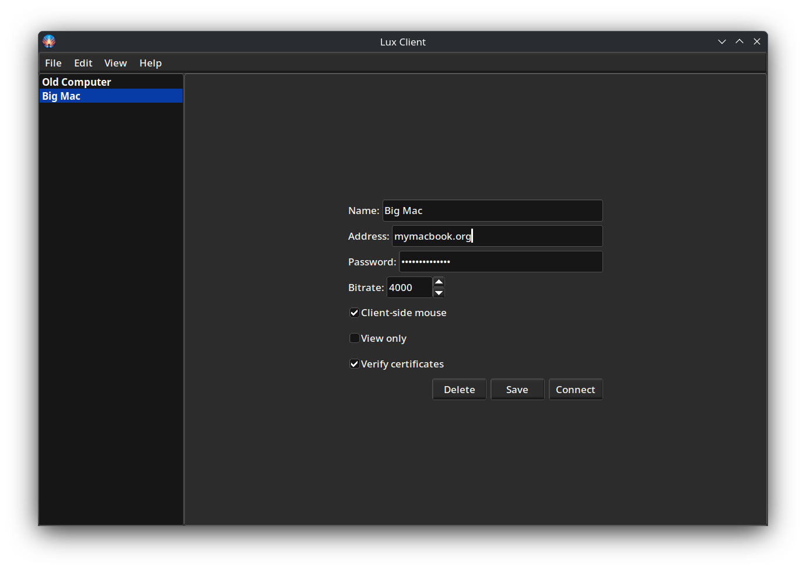
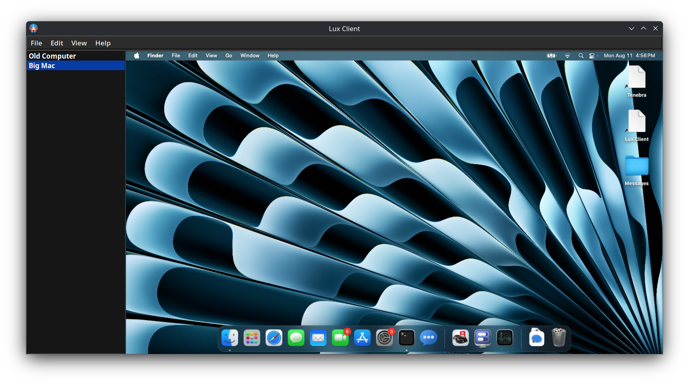

*An instance of Lux viewing a Kubuntu desktop.*

# Lux Desktop

Lux is an extremely smooth remote desktop client. Lux can connect to [Tenebra](https://github.com/UE2020/tenebra) to control another machine.

## Usage

Lux is a cross-platform desktop app that depends on FLTK, SDL, and GStreamer. It can be compiled using `make`.
